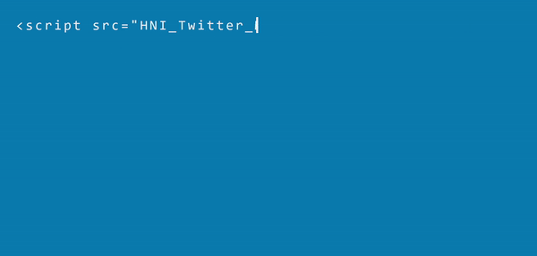

# Botclub-bot
This is a web-based bot made for Het Nieuwe Instituut's Bot Club online magazine (https://botclub.hetnieuweinstituut.nl/en). It loaded tweets from other Twitter bots and parsed them dynamically into a custom CSS feed that functioned as the background for the online magazine. 

It's a conceptual background-graphic for the web-magazine, that takes live code as graphic design because the web-magazine is focused on creative coding. 

This project uses code created by Cypress North (https://cypressnorth.com/programming/how-to-easily-display-a-twitter-feed-using-javascript/).

